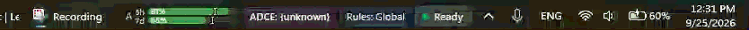

# Caster Plugins Repository

Dedicated distribution repository for optional Caster plugins, visual overlays, and external bridges.



> **Live Telemetry & Context In Action**: Combining [**`taskbar_hud`**](plugins/taskbar_hud) with the **`adce`** (Active Desktop Context Engine) plugin projects real-time speech hypotheses, executed commands, microphone states, and sub-window semantic focus zones directly into the Windows 11 Taskbar system tray.

---

## Overview
This repository hosts standalone plugins for the [Caster](https://github.com/dictation-toolbox/Caster) voice programming framework. By separating advanced integrations from Caster Core, the core repository remains minimal and focused strictly on grammar execution.

## Available Plugins

| Plugin | Version | Description | Target Environment |
|---|---|---|---|
| **`themed_hud`** | `2.0.0` | Modular PyQt Heads-Up Display with 10+ QSS themes, opacity sliders, status bar, and ADCE context strip. | Windows 10/11 Desktop Overlay |
| [**`taskbar_hud`**](plugins/taskbar_hud) | `1.0.0` | Named Pipe bridge projecting real-time speech telemetry directly into the Windows 11 Taskbar via [Caster Taskbar HUD](https://github.com/amirf147/caster-taskbar-hud). | Windows 11 Taskbar |
| **`adce`** | `1.0.0` | Active Desktop Context Engine SSE client providing sub-millisecond focus predicates for integrated terminals. | Local HTTP/SSE Port 8424 |

## Installation Workflow

Users install plugins into their personal user directory via the Caster plugin CLI:

```powershell
py -3.10 -m castervoice.bin.plugin_cli list
py -3.10 -m castervoice.bin.plugin_cli install themed_hud
```

Plugins install into `%LOCALAPPDATA%\caster\caster_user_content\plugins\<name>\` and activate automatically in `settings.toml`.

## Contributing a Plugin
Each plugin directory must contain:
1. `metadata.toml`: Declarative manifest defining name, version, description, and dependencies.
2. `plugin.py`: A subclass of `PluginBase` implementing `initialize()`, `start()`, and `stop()`.
3. `__init__.py`: Package export file.
